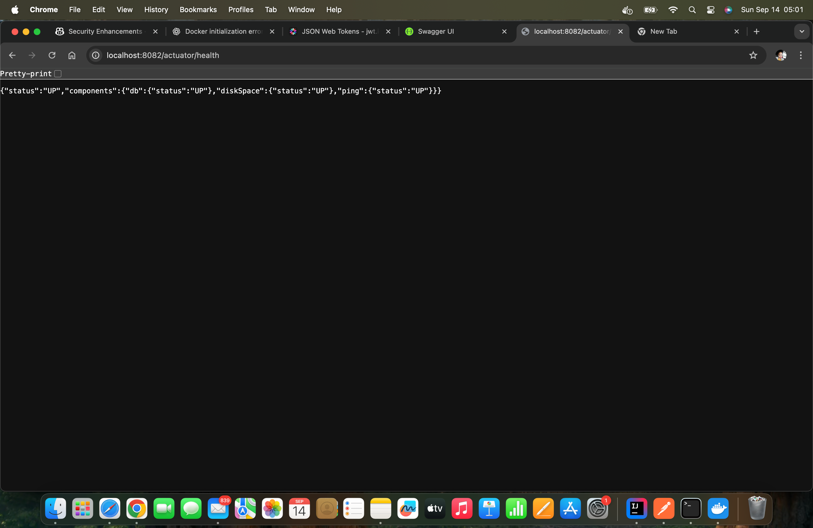

# RAG Chat Storage Service

A backend microservice for storing RAG-based chatbot conversations (sessions + messages) using Spring Boot and PostgreSQL.  
**Ready for production extension—demonstrates real-world backend patterns and best practices.**

---

## ✨ Why This Project?

- **End-to-end backend skills:** API design, security, persistence, caching, docs, and DevOps.
- **Production-readiness:** Health checks, OpenAPI, rate limiting, Dockerization, and migrations.
- **Real-world patterns:** Soft delete, paginated APIs, caching, error handling, and testability.

---

## Features

- Create & manage chat sessions (rename, favorite, soft-delete)
- Store chat messages with roles and optional retrieved context (`JSONB`)
- Pagination for listing sessions and messages
- API key and JWT authentication (`X-API-Key`, `Authorization: Bearer ...`)
- Rate limiting per API key (Bucket4j)
- Flyway migrations
- OpenAPI / Swagger UI
- Health endpoints (Actuator)
- Dockerized (app + PostgreSQL + optional pgAdmin)
- In-memory caching with `@Cacheable`
- Service and integration tests (JUnit, Testcontainers)

---

## Tech Stack

| Layer         | Technology                  |
|---------------|-----------------------------|
| Language      | Java 17                     |
| Framework     | Spring Boot 3               |
| DB            | PostgreSQL 15               |
| Migrations    | Flyway                      |
| Auth          | API Key & JWT               |
| Rate Limiting | Bucket4j                    |
| Docs          | springdoc-openapi           |
| Packaging     | Docker / Compose            |
| CI/CD         | GitHub CI                   |
| Caching       | Spring Cache (`@Cacheable`) |

---

## Project Structure

```
src/
  main/
    java/com/rag/chat/
      config/
      controller/
      security/
      service/
      util/
  test/
```

---

## Quick Start

```bash
cp .env.example .env
docker compose up --build
```
- App: [http://localhost:8080](http://localhost:8080)
- Swagger: [http://localhost:8080/swagger-ui/index.html](http://localhost:8080/swagger-ui/index.html)
- Health: [http://localhost:8080/actuator/health](http://localhost:8080/actuator/health)

---

## API Authentication

Send header:
```
X-API-Key: <one of keys from .env API_KEY>
```
or use a valid JWT via the `Authorization` header.

---

## Endpoints (Summary)

| Method | Path | Description |
|--------|------|-------------|
| POST   | /api/v1/sessions                  | Create session          |
| GET    | /api/v1/sessions?...              | List sessions          |
| GET    | /api/v1/sessions/{id}             | Get session            |
| PATCH  | /api/v1/sessions/{id}             | Update (title, favorite)|
| DELETE | /api/v1/sessions/{id}             | Soft delete            |
| POST   | /api/v1/sessions/{id}/messages    | Add message            |
| GET    | /api/v1/sessions/{id}/messages    | List messages          |

See Swagger UI for full schema details.

---

## Example Requests

**Create Session:**
```bash
curl -X POST http://localhost:8080/api/v1/sessions \
  -H 'Content-Type: application/json' \
  -H 'X-API-Key: change-me' \
  -d '{"userId":"user-123","title":"Embedding Research"}'
```

**Add Message:**
```bash
curl -X POST http://localhost:8080/api/v1/sessions/{sessionId}/messages \
  -H 'Content-Type: application/json' \
  -H 'X-API-Key: change-me' \
  -d '{
    "role":"USER",
    "content":"Explain vector similarity",
    "retrievedContext":[{"docId":1,"snippet":"cosine similarity ..."}],
    "metadata":{"model":"gpt-4","latencyMs":1200}
  }'
```

**List Messages:**
```bash
curl -H 'X-API-Key: change-me' \
  "http://localhost:8080/api/v1/sessions/{sessionId}/messages?page=0&size=20"
```

---

## Caching Strategy

Spring's `@Cacheable` is used for in-memory caching of frequently accessed data (e.g., sessions/messages).  
**For this case study:**
- In-memory cache (simple, great for single-node or demo).
- **Real-world:** Use Redis for distributed cache.
- Caching can be extended to user/session/message lookups for performance.

*In distributed systems, consider integrating Redis for cache consistency and Kafka for real-time streaming.*

---

## Rate Limiting

- Configurable via:
  ```
  RATE_LIMIT_CAPACITY
  RATE_LIMIT_REFILL_TOKENS
  RATE_LIMIT_REFILL_PERIOD_SECONDS
  ```
- HTTP 429 returned when exceeded (per API key).

---

## Environment Variables

See [.env.example](.env.example)

---

## Database Migrations

Flyway auto-runs migrations under `src/main/resources/db/migration`.

---

## Soft Deletion

Sessions are soft-deleted (timestamp in `deleted_at`).  
Messages remain (or can be cascaded with logic if needed).  
Queries exclude deleted sessions by default.

---

## Testing

- **Unit tests:** Services, utilities, and controller logic.
- **Integration tests:** Real PostgreSQL via Testcontainers.
- **How to run:**
  ```bash
  ./gradlew test
  ```
  or use Maven equivalent.

---

## Future Enhancements

- Cursor pagination for large datasets
- Redis-backed distributed caching/rate limiting
- Full-text search within messages
- Export session data (JSON/CSV)
- Hexagonal architecture for testability
- CircuitBreaker & resilience patterns
- MicroMeter metrics

---

## Demo / Screenshots


> 
> 
---

## Contributing / Feedback

Feedback, bug reports, and pull requests are welcome!

---

## License

MIT: https://opensource.org/license/MIT
