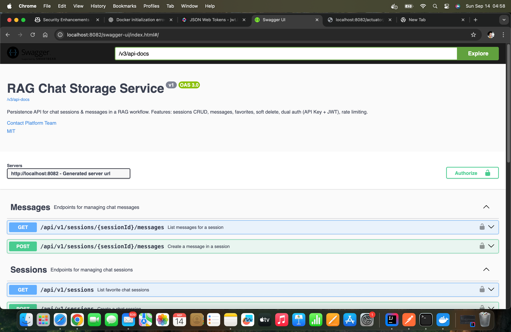
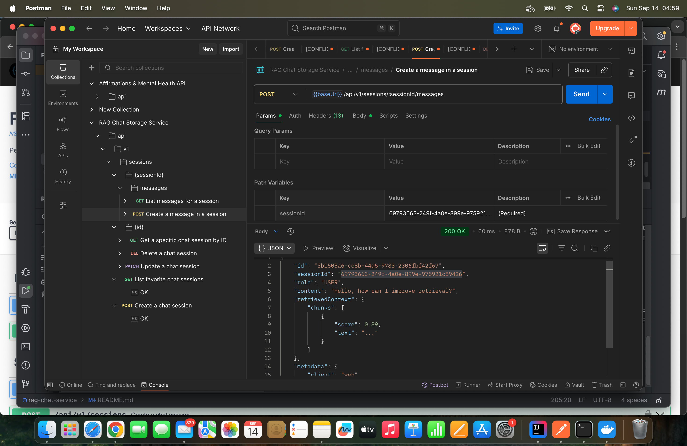
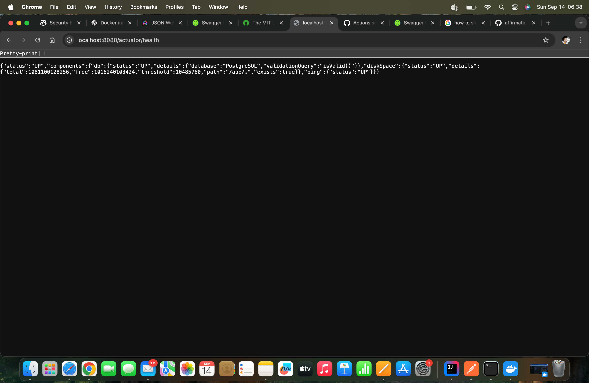

# RAG Chat Storage Service

A backend microservice for storing RAG-based chatbot conversations (sessions + messages) using Spring Boot and PostgreSQL.  
**Ready for production extension—demonstrates real-world backend patterns and best practices.**

---

## ✨ Why This Project?

- **End-to-end backend skills:** API design, security, persistence, caching, docs, and DevOps.
- **Production-readiness:** Health checks, OpenAPI, rate limiting, Dockerization, and migrations.
- **Real-world patterns:** Soft delete, paginated APIs, caching, error handling, and testability.

---

## Features

- Create & manage chat sessions (rename, favorite, soft-delete)
- Store chat messages with roles and optional retrieved context (`JSONB`)
- Pagination for listing sessions and messages
- API key and JWT authentication (`X-API-Key`, `Authorization: Bearer ...`)
- Rate limiting per API key (Bucket4j)
- Flyway migrations
- OpenAPI / Swagger UI
- Health endpoints (Actuator)
- Dockerized (app + PostgreSQL + optional pgAdmin)
- In-memory caching with `@Cacheable`
- Service and integration tests (JUnit, Testcontainers)

---

## Tech Stack

| Layer         | Technology                  |
|---------------|-----------------------------|
| Language      | Java 17                     |
| Framework     | Spring Boot 3               |
| DB            | PostgreSQL 15               |
| Migrations    | Flyway                      |
| Auth          | API Key & JWT               |
| Rate Limiting | Bucket4j                    |
| Docs          | springdoc-openapi           |
| Packaging     | Docker / Compose            |
| CI/CD         | GitHub CI                   |
| Caching       | Spring Cache (`@Cacheable`) |

---

## Project Structure

```
src/
  main/
    java/com/rag/chat/
      config/
      controller/
      security/
      service/
      util/
  test/
```

---

## Setup & Running Instructions

### 1. **Clone the Repository**
```bash
git clone https://github.com/your-username/your-repo.git
cd your-repo
```

### 2. **Configure Environment Variables**
- Copy the example environment file and fill in your secrets:
  ```bash
  cp .env.example .env
  ```
- Edit `.env` to set your database URL, API keys, JWT secret, etc.

### 3. **Build and Run with Docker Compose**
> This will start the Spring Boot app, PostgreSQL, and optional pgAdmin.
```bash
docker compose up --build
```

- The backend will be accessible at: [http://localhost:8080](http://localhost:8080)
- Swagger UI: [http://localhost:8080/swagger-ui/index.html](http://localhost:8080/swagger-ui/index.html)
- Health check: [http://localhost:8080/actuator/health](http://localhost:8080/actuator/health)

### 4. **(Optional) Run with Local Java**
If you have Java 17+ and PostgreSQL running locally:
```bash
mvn spring-boot:run
```
- Configure your local `application.properties` or use environment variables as described above.

### 5. **Database Migrations**
- Flyway will automatically run migrations at startup.

### 6. **Run Tests**
```bash
mvn test
```

### 7. **Accessing the Application**

- **API Base URL:** `http://localhost:8080/api/v1`
- **Swagger UI:** [http://localhost:8080/swagger-ui/index.html](http://localhost:8080/swagger-ui/index.html)
- **Health Endpoint:** [http://localhost:8080/actuator/health](http://localhost:8080/actuator/health)

### 8. **Authentication**
Both JWT token and API key are required.
- Use an API key from your `.env` file as the header:
  ```
  X-API-Key: <your-api-key>
  ```
-  And use a valid JWT in the `Authorization` header.
- ## Generating a JWT Token for Testing

To test endpoints that require JWT authentication, you can generate a JWT token manually using the [jwt.io](https://www.jwt.io/) website:

### Steps

1. **Go to [jwt.io](https://www.jwt.io/)**

2. **Set the JWT Payload (Example):**
    ```json
    {
      "sub": "rag-service",
      "role": "INTERNAL_SERVICE",
      "iss": "rag-service",
      "aud": "chat-bot",
      "service": "rag-service",
      "exp": <FUTURE_EPOCH_SECONDS> i.e 2000000000
    }
    ```
  - **sub**: Your user ID or identifier.
  - **aud**: Should match what your backend expects (e.g., `rag-service`).
  - **service**: (if used) Should match what your backend expects.
  - **exp**: (Optional) Expiration as a UNIX timestamp in the future.

3. **Set the JWT Secret:**
  - In the "Verify Signature" section, enter the **same secret** you configured in your backend (`JWT_SECRET` from your `.env` file).

4. **Algorithm:**
  - Use `HS256` as the signing algorithm.

5. **Copy the Encoded JWT:**
  - The output at the top (“Encoded”) is your JWT token.

6. **Use in Requests:**
  - Pass the token in the `Authorization` header:
    ```
    Authorization: Bearer <your-jwt-token>

---

**For more configuration details, see comments in `.env.example` and `docker-compose.yml`.**

## Quick Start

```bash
cp .env.example .env
docker compose up --build
```
- App: [http://localhost:8080](http://localhost:8080)
- Swagger: [http://localhost:8080/swagger-ui/index.html](http://localhost:8080/swagger-ui/index.html)
- Health: [http://localhost:8080/actuator/health](http://localhost:8080/actuator/health)

---

## API Authentication

Send header:
```
X-API-Key: <one of keys from .env API_KEY>
```
or use a valid JWT via the `Authorization` header.

---

## Endpoints (Summary)

| Method | Path | Description |
|--------|------|-------------|
| POST   | /api/v1/sessions                  | Create session          |
| GET    | /api/v1/sessions?...              | List sessions          |
| GET    | /api/v1/sessions/{id}             | Get session            |
| PATCH  | /api/v1/sessions/{id}             | Update (title, favorite)|
| DELETE | /api/v1/sessions/{id}             | Soft delete            |
| POST   | /api/v1/sessions/{id}/messages    | Add message            |
| GET    | /api/v1/sessions/{id}/messages    | List messages          |

See Swagger UI for full schema details.

---

## Example Requests

**Create Session:**
```bash
curl -X POST http://localhost:8080/api/v1/sessions \
  -H 'Content-Type: application/json' \
  -H 'X-API-Key: change-me' \
  -d '{"userId":"user-123","title":"Embedding Research"}'
```

**Add Message:**
```bash
curl -X POST http://localhost:8080/api/v1/sessions/{sessionId}/messages \
  -H 'Content-Type: application/json' \
  -H 'X-API-Key: change-me' \
  -d '{
    "role":"USER",
    "content":"Explain vector similarity",
    "retrievedContext":[{"docId":1,"snippet":"cosine similarity ..."}],
    "metadata":{"model":"gpt-4","latencyMs":1200}
  }'
```

**List Messages:**
```bash
curl -H 'X-API-Key: change-me' \
  "http://localhost:8080/api/v1/sessions/{sessionId}/messages?page=0&size=20"
```

---

## Caching Strategy

Spring's `@Cacheable` is used for in-memory caching of frequently accessed data (e.g., sessions/messages).  
**For this case study:**
- In-memory cache (simple, great for single-node or demo).
- **Real-world:** Use Redis for distributed cache.
- Caching can be extended to user/session/message lookups for performance.

*In distributed systems, consider integrating Redis for cache consistency and Kafka for real-time streaming.*

---

## Rate Limiting

- Configurable via:
  ```
  RATE_LIMIT_CAPACITY
  RATE_LIMIT_REFILL_TOKENS
  RATE_LIMIT_REFILL_PERIOD_SECONDS
  ```
- HTTP 429 returned when exceeded (per API key).

---

## Environment Variables

See [.env.example](.env.example)

---

## Database Migrations

Flyway auto-runs migrations under `src/main/resources/db/migration`.

---

## Soft Deletion

Sessions are soft-deleted (timestamp in `deleted_at`).  
Messages remain (or can be cascaded with logic if needed).  
Queries exclude deleted sessions by default.

---

## Testing

- **Unit tests:** Services, utilities, and controller logic.
- **Integration tests:** Real PostgreSQL via Testcontainers.
- **How to run:**
  ```bash
  mvn clean package
  ```

---

## Future Enhancements

- Cursor pagination for large datasets
- Redis-backed distributed caching/rate limiting
- Full-text search within messages
- Export session data (JSON/CSV)
- Hexagonal architecture for testability
- CircuitBreaker & resilience patterns
- MicroMeter metrics

---

## Demo / Screenshots


> 
>

---

## Contributing / Feedback

Feedback, bug reports, and pull requests are welcome!

---

## License

MIT: https://opensource.org/license/MIT
